# Laravel Role Permission Management System - Laravel `11.x`

This is a Todo Application built using the Laravel framework and MySQL database. It provides functionality for creating, updating, and deleting todo items, with role-based permissions to control access to various features of the application.


**Demo:** http://localhost:8000
```
Username - superadmin
password - 12345678
```

## Requirements:
- Laravel `7.x` | `9.7` | `11.x`
- Spatie role permission package  `^6.4`

## Git Repository:

## Project Setup
Git clone -
```console
git clone https://github.com/sonalirv01/laravelToDoApplication.git
```

Install Laravel Dependencies -
```console
composer install
```

Create database called - `laravel_role`

Create `.env` file by copying `.env.example` file

Generate Artisan Key (If needed) -
```console
php artisan key:generate
```

Migrate Database with seeder -
```console
php artisan migrate --seed
```

Run Project -
```php
php artisan serve
```

Since, there is any problem to seeder, Please import the .sql file directly - https://github.com/sonalirv01/laravelToDoApplication/blob/master/database/sql/laravel_role.sql

So, You've got the project of Laravel Role & Permission Management on your http://localhost:8000

## How it works
1. Login using Super Admin Credential -
    1. Username - `superadmin`
    1. Password - `12345678`
2. Create Admin
3. Create Role
4. Create Todo Task
5. Assign Permission to Roles
6. Assign Multiple Role to an admin
7. Check by login with the new credentials.
8. If you've not enough permission to do any task, you'll get a warning message.


### Login & Dashboard Page
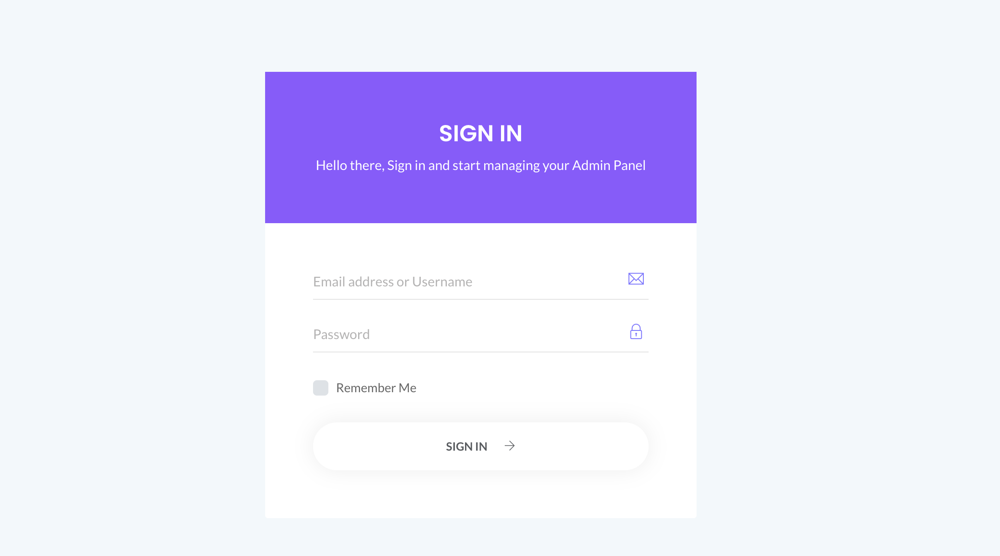


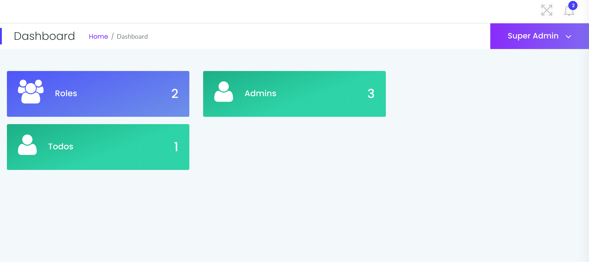

### Role Pages
Role List
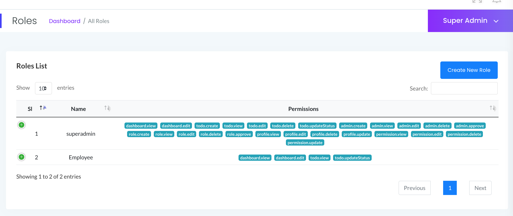
Role Create
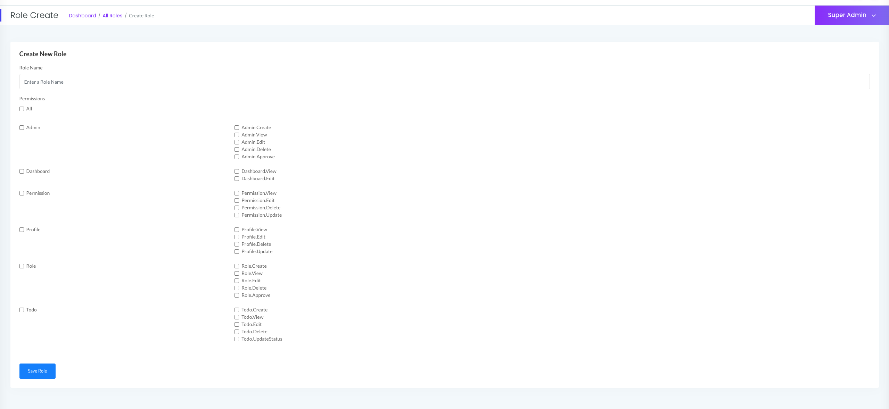
Role Edit
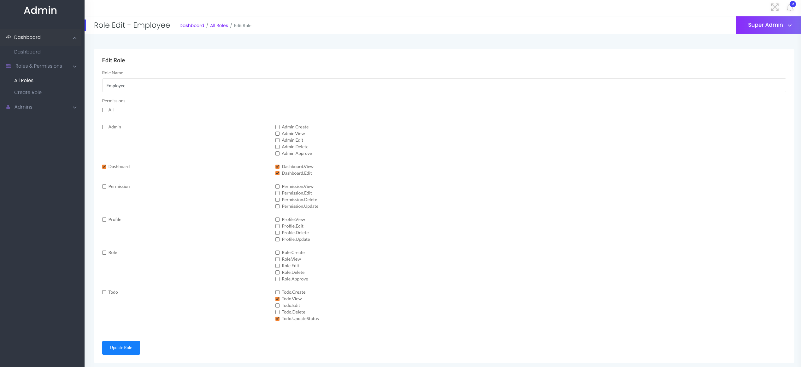

### Admin Pages
Admin List
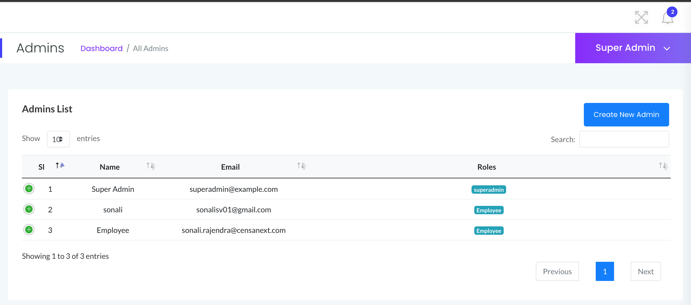
Admin Create
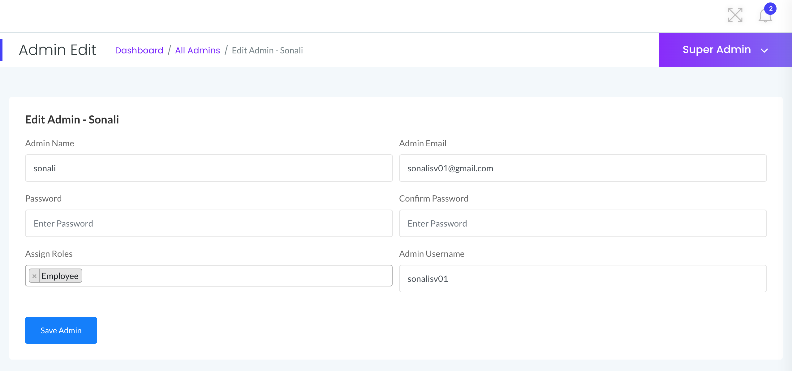

### Todo Pages
Todo List
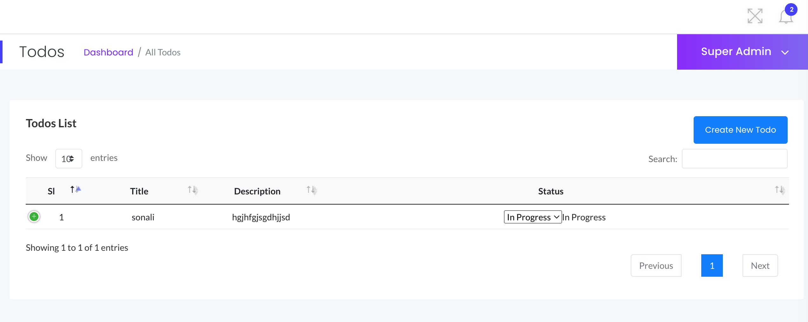
Todo Create
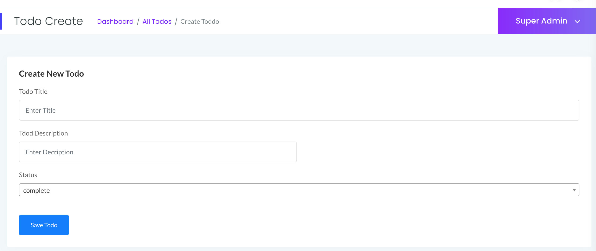
Todo Edit
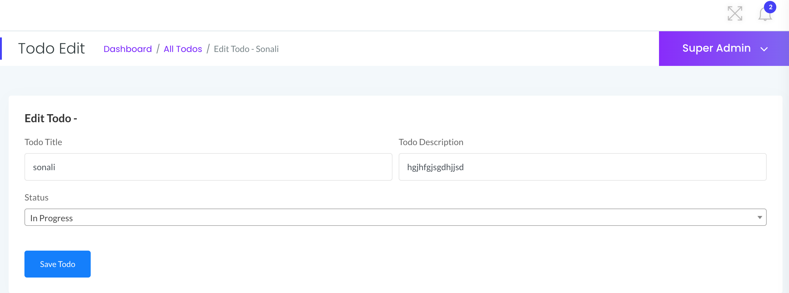

### Other Pages
Custom Error Pages
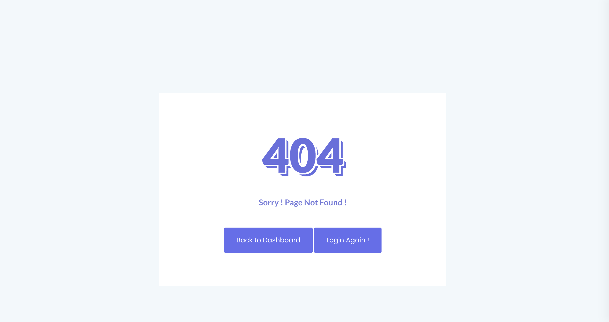


# LaravelToDo-app-with-userpermission
# laravelToDoApplication
